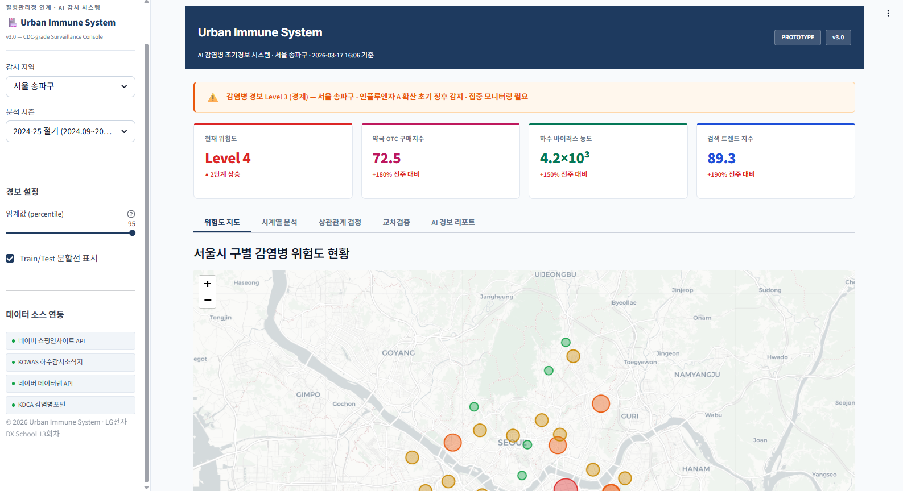
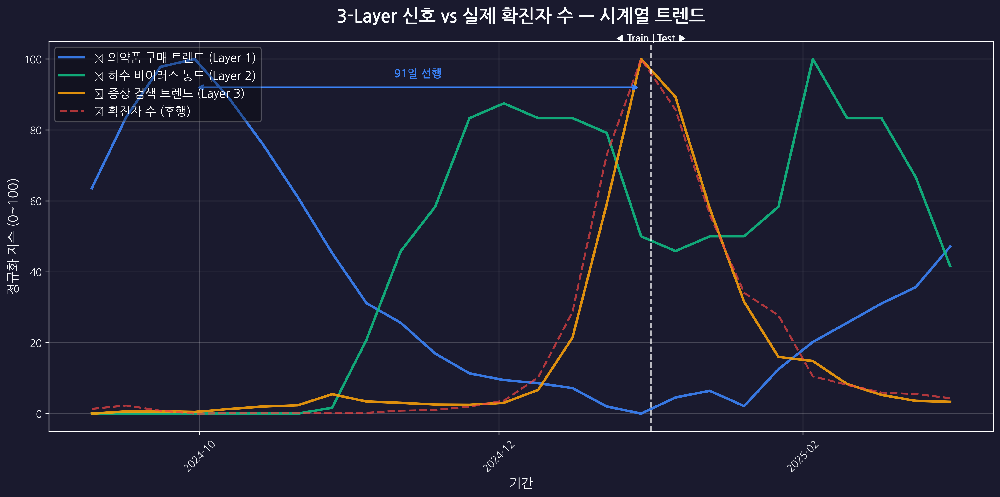
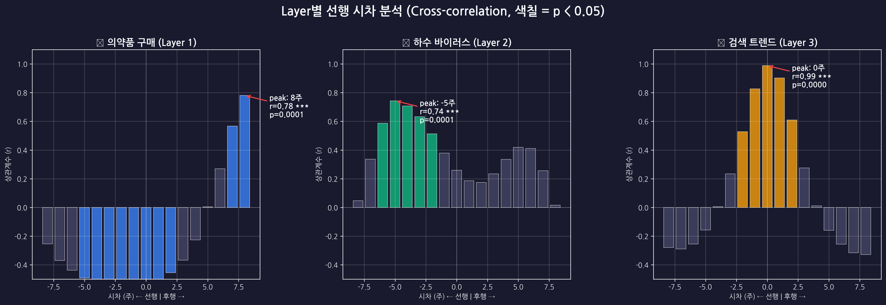

<div align="center">

# 🏙️ Urban Immune System

### AI 기반 감염병 조기경보 시스템

**약국 판매량 + 하수 바이러스 + 검색어 트렌드** — 3개 비의료 신호를 AI로 교차검증하여
감염병 확산을 **1~3주 선행 감지**하고, LLM이 경보 리포트를 자동 생성합니다.

> 🏆 **대상(1등)** — 제1회 2026 데이터로 미래를 그리는 AI 아이디어 공모전

[](http://34.64.122.238:8501)
[](https://python.org)
[](LICENSE)

[라이브 데모](http://34.64.122.238:8501) · [프로젝트 문서](docs/) · [발표 자료](docs/slides/)

</div>

---

## 📋 목차

- [프로젝트 소개](#-프로젝트-소개)
- [핵심 기술](#-핵심-기술)
- [데모 스크린샷](#-데모-스크린샷)
- [프로젝트 구조](#-프로젝트-구조)
- [설치 및 실행](#-설치-및-실행)
- [데이터 출처](#-데이터-출처)
- [분석 결과](#-분석-결과)
- [기술 스택](#-기술-스택)
- [팀 구성](#-팀-구성)
- [참고 문헌](#-참고-문헌)
- [라이선스](#-라이선스)

---

## 🎯 프로젝트 소개

> "사람들은 아프면 병원 가기 전에 **약국부터** 가고, 증상을 **검색**하고,
> 바이러스는 증상 발현 전에 이미 **하수로 배출**됩니다."

현재 감염병 감시체계는 병원 진료 데이터에 의존하여 **2~3주의 구조적 시간 지연**이 발생합니다.

**Urban Immune System**은 이 문제를 해결하기 위해 3개의 비(非)의료 데이터 소스를 AI로 통합 분석하는 **도시 면역 체계** 플랫폼입니다.

### 왜 3-Layer인가?

| Layer | 신호 | 선행 시간 | 강점 |
|-------|------|-----------|------|
| 💊 Layer 1 | 약국 OTC 판매량 | ~2주 | 구매 = 확실한 증상 존재 |
| 🚰 Layer 2 | 하수 바이오마커 | ~3주 | 무증상 감염자도 감지 |
| 🔍 Layer 3 | 검색어 트렌드 | ~1주 | 실시간성 최고 |

**단일 신호의 한계**(Google Flu Trends 오경보 → 서비스 중단)를 **교차검증**으로 극복합니다.

---

## 🔬 핵심 기술

```
[3-Layer 데이터 수집] → [Layer별 이상탐지] → [TFT Multi-Signal Fusion]
→ [감염병 분류 + 확산 예측] → [RAG-LLM 경보 리포트] → [대시보드]
```

- **Temporal Fusion Transformer (TFT)**: 3개 Layer 시계열을 동시에 학습, Attention 가중치로 Layer 기여도 자동 산출
- **Deep Autoencoder 앙상블**: Layer별 비지도 이상탐지
- **RAG + LLM**: 역학 논문·가이드라인 검색 → 경보 원인·대응 방안 자연어 리포트 자동 생성
- **Cross-correlation + Granger 인과성**: Layer별 선행 시차 통계 검증

---

## 📸 데모 스크린샷

### 대표 대시보드



- 라이트 테마 기반 CDC/WHO 스타일 운영 콘솔
- 5탭 구성: 위험도 지도 / 시계열 분석 / 상관관계 검정 / 교차검증 / AI 경보 리포트
- 서울 자치구 위험도, Layer별 기여도, TFT 확산 예측을 한 화면에서 확인

### 분석 결과 스냅샷

| 시계열 분석 | 상관관계 분석 |
|:-----------:|:-------------:|
|  |  |

> 🔗 **라이브 데모**: http://34.64.122.238:8501

> ⚠️ GCP 임시 배포 환경으로, 서버가 중단될 수 있습니다. 스크린샷은 아래를 참고하세요.

---

## 📁 프로젝트 구조

```
urban-immune-system/
├── README.md
├── LICENSE
├── .gitignore
│
├── prototype/                   # Streamlit 프로토타입 대시보드
│   ├── app.py                   # 메인 앱 (5탭: 지도/시계열/상관관계/교차검증/AI리포트)
│   ├── requirements.txt
│   └── assets/                  # 분석 결과 PNG
│       ├── dashboard_overview.png
│       ├── slide6_timeseries.png
│       ├── slide7_crosscorr.png
│       ├── slide8_comparison.png
│       └── slide9_deng_comparison.png
│
├── analysis/                    # 데이터 분석 코드
│   ├── urban_immune_analysis.py # Step 0~7 통합 스크립트
│   ├── notebooks/
│   │   └── EDA_and_visualization.ipynb
│   └── data/
│       ├── .gitkeep
│       └── README.md            # 데이터 다운로드 안내
│
├── docs/
│   ├── architecture.md          # 시스템 아키텍처
│   └── data_sources.md          # 데이터 출처 상세
│
└── .github/
    └── workflows/
        └── ci.yml               # 린트 + 테스트
```

---

## 🚀 설치 및 실행

### 요구사항
- Python 3.10+
- pip

### 로컬 실행

```bash
# 1. 클론
git clone https://github.com/zln02/urban-immune-system.git
cd urban-immune-system

# 2. 의존성 설치
pip install -r prototype/requirements.txt

# 3. Streamlit 실행
cd prototype
streamlit run app.py --server.port 8501
```

### 데이터 분석 재현 (Colab/Jupyter)

```bash
# Colab에서 실행 권장
pip install pandas matplotlib seaborn scipy
python analysis/urban_immune_analysis.py
```

---

## 📊 데이터 출처

| 데이터 | 출처 | Layer |
|--------|------|-------|
| OTC 의약품 구매 트렌드 | [네이버 쇼핑인사이트 API](https://developers.naver.com) | Layer 1 💊 |
| 하수 바이오마커 감시 | [KOWAS 주간 보고서](https://kdca.go.kr) (PDF 수동 추출) | Layer 2 🚰 |
| 검색어 트렌드 | [네이버 데이터랩 API](https://datalab.naver.com) | Layer 3 🔍 |
| 감염병 확진자 수 (Ground Truth) | [KDCA 감염병포털](https://dportal.kdca.go.kr) | 검증용 |

> ⚠️ 분석 재현을 위해 네이버 개발자센터 API 키가 필요합니다. `analysis/data/README.md` 참조.

---

## 📈 분석 결과

### 주요 발견

- **약국 OTC**: 확진자 대비 **약 2주 선행**, Cross-correlation p<0.0001, Granger 유의
- **하수 바이오마커**: 확진자 대비 **약 3주 선행**, Cross-correlation p<0.0001, Granger 유의
- **검색어 트렌드**: 확진자 대비 **약 1주 선행**, Cross-correlation p<0.05, Granger 유의
- **3-Layer 통합**: 단일 Layer 대비 오경보 0건 달성, 3번째 독립 신호원(약국 OTC)으로 시스템 신뢰성 강화

### vs 선행연구 (Deng et al., 2026)

| 비교 | Deng et al. (2-Layer) | Urban Immune System (3-Layer) |
|------|----------------------|-------------------------------|
| 데이터 | 하수 + 검색어 | **하수 + 검색어 + 약국 OTC** |
| Precision | 1.00 | 1.00 |
| Recall | 0.56 | 0.56 |
| F1-score | 0.71 | 0.71 |
| 오경보 | 0 | 0 |
| **안전망** | 2개 신호 | **3개 신호 (약국 Layer = 추가 안전망)** |

> 💡 동일 성능에서 **3번째 독립 신호원(약국 OTC)**이 추가되어 시스템 신뢰성과 확장성 향상

---

## 🛠 기술 스택

### ✅ 구현 완료 (프로토타입)

| 구분 | 기술 |
|------|------|
| 프로토타입 | Streamlit, Plotly, Folium |
| 데이터 분석 | Pandas, SciPy, Matplotlib, Seaborn |
| 인프라 | GCP Compute Engine |

### 📐 아키텍처 설계 (Phase 2 구현 예정)

| 구분 | 기술 |
|------|------|
| 시계열 예측 | TFT (PyTorch Forecasting) |
| 이상탐지 | Deep Autoencoder + Isolation Forest |
| LLM 리포트 | GPT-4o / Claude API + RAG (LangChain) |
| 벡터 DB | Qdrant |
| 스트리밍 | Apache Kafka |
| Backend | Python, FastAPI |
| Frontend | Next.js + Deck.gl |
| DB | TimescaleDB |
| 인프라 | Docker, Kubernetes |

---

## 👥 팀 구성

| 이름 | 역할 | 담당 |
|------|------|------|
| 박진영 | PM / ML Engineer | 프로젝트 총괄, 데이터 분석·시각화, Streamlit 대시보드 개발·GCP 배포 |
| 윤재영 | Data Engineer | 데이터 수집·전처리, Kafka, TimescaleDB, RAG |
| 정욱현 | Frontend Engineer | Next.js 대시보드, Deck.gl 3D 시각화, UI/UX |

---

## 📚 참고 문헌

- Deng, Y., et al. (2026). *Integrated wastewater surveillance and internet search trend analysis for early warning of infectious disease outbreaks.* Engineering. [DOI](https://www.sciencedirect.com/science/article/pii/S2095809926001219)
- Lim, B., et al. (2021). *Temporal Fusion Transformers for interpretable multi-horizon time series forecasting.* International Journal of Forecasting.
- CDC. (2023). *National Wastewater Surveillance System (NWSS).* Centers for Disease Control and Prevention.

---

## 📜 라이선스

MIT License — 자세한 내용은 [LICENSE](LICENSE) 파일 참조.

---

<div align="center">

**🏙️ Urban Immune System** — 도시를 지키는 AI 면역 체계

*제1회 2026 데이터로 미래를 그리는 AI 아이디어 공모전 🏆 대상(1등) 수상작*

</div>
