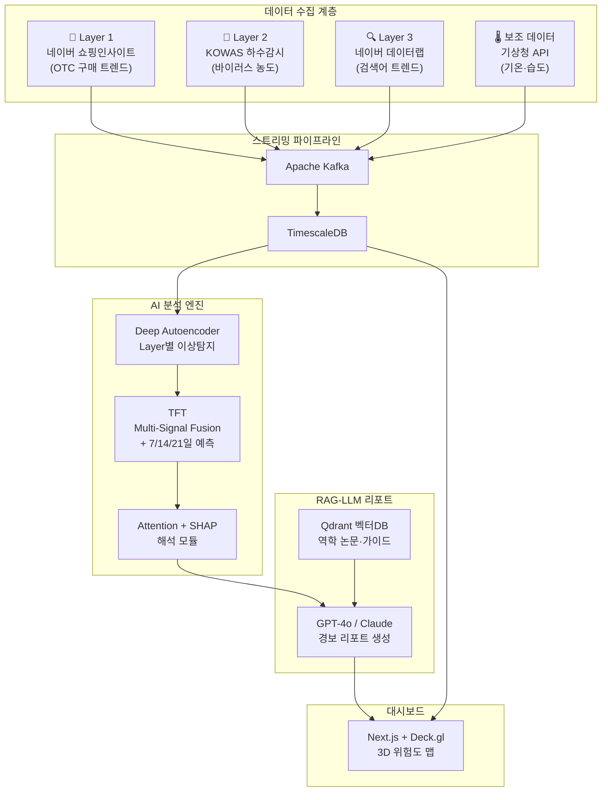

# 도시 면역 체계 (Urban Immune System)

AI 기반 감염병 조기경보 시스템

## 프로젝트 개요

| 항목 | 내용 |
| --- | --- |
| 프로젝트명 | 도시 면역 체계 (Urban Immune System) — AI 기반 감염병 조기경보 시스템 |
| 분류 | 동신대학교 컴퓨터공학과 · 캡스톤 디자인 |
| 핵심 기술 | 약국 OTC · 하수 바이오마커 · 검색 트렌드 |
| 목표 | 3개 비의료 신호를 AI(TFT)로 교차검증하여 감염병을 1~3주 선행 감지 · RAG-LLM 자동 리포트 |
| 선행 실적 | 제1회 2026 데이터로 미래를 그리는 AI 아이디어 공모전 대상(1등) 수상 (LG전자 DX School) |

|  | 박진영 | 이경준 | 이우형 | 김나영 | 박정빈 |
| --- | --- | --- | --- | --- | --- |
| ROLE | PM / ML Lead | Backend | Data Engineer | Frontend | DevOps / QA |

> 역할은 유동적입니다. 캡스톤은 전원이 전체 시스템을 이해해야 하며, 위 역할은 1차 책임 영역입니다. 코드 리뷰와 페어 프로그래밍으로 전원이 모든 모듈을 경험합니다.

---

## 왜 이 프로젝트인가?

### 현재 문제

현재 감염병 감시는 병원 진료 후 집계되므로 2~3주의 구조적 지연이 발생합니다.

- Google Flu Trends(2015 종료), K-WBE(단일 신호) 기반 접근의 한계
- 단일 데이터 소스 기반 감시는 오경보와 설명력 한계 존재

### 우리의 해법

- 약국 OTC + 하수 바이러스 + 검색어 트렌드의 3-Layer 교차검증
- Deng et al. (2026)의 2-Layer 접근에 약국 OTC Layer를 추가한 3-Layer 차별화

### 검증된 아이디어

- 공모전 대상(1등)
- 실데이터 분석 완료
- Streamlit 프로토타입 GCP 배포 경험 확보

### 캡스톤 목표

데이터 파이프라인 → ML 모델 → LLM 리포트 → 3D 대시보드까지 End-to-End 풀스택 구현

---

## 시스템 아키텍처



---

## 공모전 → 캡스톤 개선·검증 사항

| 항목 | 공모전 (기획서) | 캡스톤 (실구현) | 상태 |
| --- | --- | --- | --- |
| Layer 1 데이터 | 심평원 API (처방약) | 네이버 쇼핑인사이트 (OTC 구매 트렌드) | ✅ 검증 완료 |
| Layer 2 데이터 | K-WBE API (존재하지 않음) | KOWAS PDF 수동 추출 → 향후 자동화 (OCR/크롤링) | ✅ 검증 완료 |
| Layer 3 독립성 | Layer 1과 키워드 중복 가능성 | 쇼핑(구매) vs 검색(증상) 완전 분리 | ✅ 검증 완료 |
| 하수 데이터 순환논리 | shift(-3)로 가상 생성 | KOWAS 실데이터 (26주치 수동 추출) | ✅ 해결됨 |
| 통계 검증 | 없음 | 교차상관 p-value + Granger 인과검정 + Train/Test Split | ✅ 3차 검증 완료 |
| 선행연구 비교 | 언급만 | Deng et al. 2-Layer vs 3-Layer 정량 비교 | ✅ 완료 |
| 프로토타입 | 시뮬레이션 데이터 | 실데이터 기반 Streamlit 대시보드 (GCP 배포 완료) | ✅ 완료 |
| 오경보율 주장 | 70% 감소 | 교차검증 기반 대폭 감소 (목표) — 과장 수치 제거 | ✅ 수정됨 |
| TFT SOTA 주장 | SOTA | 고성능 해석 가능 모델 (PatchTST 등 후속 모델 존재 인정) | ✅ 수정됨 |

---

## 검증된 분석 결과

### 핵심 성능 지표

- 3-Layer F1-Score: 0.71
- Precision: 1.00
- Granger 인과검정: 3개 Layer 모두 유의 (p < 0.05)
- Deng 2-Layer 대비: 동일 성능 + 안전망 확보

### 선행 시차 (Lead Time)

- 하수 바이오마커: 약 3주
- 약국 OTC 구매: 약 2주
- 검색어 트렌드: 약 1주

### 분석 방법론

1. 데이터 수집: 네이버 쇼핑인사이트(L1) + KOWAS PDF(L2) + 네이버 데이터랩(L3) + KDCA 인플루엔자(GT)
2. 전처리: Min-Max 정규화(0~100), 주간 단위 정렬, 결측치 보간
3. Train/Test Split: 2025-01-01 기준 (Train: 37~52주, Test: 1~10주)
4. 교차상관분석: lag -8~+8주, Pearson r + p-value
5. Granger 인과검정: 각 Layer → GT 방향, maxlag=4
6. F1-최적화 임계값: Train에서 threshold 탐색 → Test에서 성능 평가
7. Deng et al. 비교: 2-Layer(L2+L3) vs 3-Layer(L1+L2+L3) 동일 조건

---

## 기술 스택

| 계층 | 기술 | 선정 이유 | 담당 |
| --- | --- | --- | --- |
| 데이터 수집 | Python (httpx, Selenium) | 비동기 API 호출 + 크롤링 | 이우형 |
| 스트리밍 | Apache Kafka | 실시간 시계열 파이프라인 (산업 표준) | 이우형 |
| 시계열 DB | TimescaleDB (PostgreSQL) | 시계열 특화 파티셔닝·압축 | 이우형 + 이경준 |
| Backend | FastAPI (Python) | 비동기 고성능, ML 모델 서빙 | 이경준 |
| 이상탐지 | Deep Autoencoder + Isolation Forest | 비지도 학습, 라벨 불필요 | 박진영 |
| 시계열 예측 | TFT (PyTorch Forecasting) | 다변량 시계열 + Attention 해석 | 박진영 |
| LLM 리포트 | GPT-4o API + RAG (LangChain) | 역학 문서 검색 → 자연어 리포트 | 박진영 + 이경준 |
| 벡터 DB | Qdrant | 오픈소스, 역학 논문 임베딩 | 박진영 |
| Frontend | Next.js + Deck.gl · Tailwind | SSR + 3D 지리 시각화 | 김나영 |
| 인프라 | Docker + Kubernetes + GCP | 컨테이너 오케스트레이션 | 박정빈 |
| CI/CD | GitHub Actions | 자동 빌드·테스트·배포 | 박정빈 |

---

## 개발 로드맵 (15주)

| 주차 | Phase | 핵심 작업 | 산출물 | 담당 |
| --- | --- | --- | --- | --- |
| 1~2주 | 환경 세팅 | GitHub 레포 구조화, Docker Compose, DB 스키마, 개발 환경 통일 | 개발환경 완성, README | 전원 (박정빈 리드) |
| 3~4주 | 데이터 파이프라인 | Layer 1/2/3 수집기 구현, Kafka → TimescaleDB 적재, 스케줄러 | 자동 수집 파이프라인 | 이우형 (이경준 지원) |
| 5~6주 | ML 모델 v1 | Deep Autoencoder 이상탐지, TFT 학습 코드, 하이퍼파라미터 튜닝 | 학습된 모델 체크포인트 | 박진영 |
| 7~8주 | Backend API | FastAPI 서버, 예측 API, 경보 API, 인증, API 문서(Swagger) | REST API 완성 | 이경준 (박진영 지원) |
| 9~10주 | RAG-LLM 리포트 | Qdrant 벡터DB 구축, 역학 문서 임베딩, LLM 리포트 생성 모듈 | 자동 경보 리포트 | 박진영 + 이경준 |
| 9~11주 | Frontend 대시보드 | Next.js 앱, Deck.gl 3D 맵, 트렌드 차트, 리포트 뷰 | 대시보드 v1 | 김나영 |
| 12~13주 | 통합 & 배포 | End-to-End 연동, K8s 배포, 성능 테스트, 버그 수정 | GCP 배포 완료 | 박정빈 + 전원 |
| 14주 | 테스트 & 최적화 | 부하 테스트, 모델 재학습, UI 개선, 엣지 케이스 처리 | 안정화 완료 | 전원 |
| 15주 | 최종 발표 | 발표 자료 제작, 데모 시나리오, 리허설, 논문/보고서 | 최종 발표 + 보고서 | 전원 |

---

## GitHub 저장소 구조

```text
urban-immune-system/
├── README.md
├── LICENSE
├── .gitignore
├── docker-compose.yml           # 로컬 개발 (Kafka + TimescaleDB + Qdrant)
├── .github/
│   └── workflows/
│       ├── ci.yml               # PR 린트 + 테스트
│       └── deploy.yml           # main 머지 시 GCP 배포
│
├── backend/                     # FastAPI 서버 (이경준)
│   ├── Dockerfile
│   ├── requirements.txt
│   └── app/
│       ├── main.py
│       ├── api/                 # REST API 라우터
│       ├── models/              # DB 모델 (SQLAlchemy)
│       ├── services/            # 비즈니스 로직
│       └── config.py
│
├── pipeline/                    # 데이터 파이프라인 (이우형)
│   ├── Dockerfile
│   ├── requirements.txt
│   └── collectors/
│       ├── otc_collector.py     # Layer 1: 네이버 쇼핑인사이트
│       ├── wastewater.py        # Layer 2: KOWAS 크롤링/OCR
│       ├── search_collector.py  # Layer 3: 네이버 데이터랩
│       ├── weather_collector.py # 보조: 기상청 API
│       └── kafka_producer.py
│
├── ml/                          # ML 모델 (박진영)
│   ├── Dockerfile
│   ├── requirements.txt
│   ├── anomaly/                 # Deep Autoencoder 이상탐지
│   ├── tft/                     # TFT 학습·추론
│   ├── rag/                     # RAG-LLM 리포트 생성
│   │   ├── vectordb.py          # Qdrant 연동
│   │   └── report_generator.py
│   └── configs/
│
├── frontend/                    # Next.js 대시보드 (김나영)
│   ├── Dockerfile
│   ├── package.json
│   └── src/
│       ├── app/
│       ├── components/
│       │   ├── map/             # Deck.gl 3D 위험도 맵
│       │   ├── charts/          # 시계열 트렌드 차트
│       │   └── report/          # 경보 리포트 뷰
│       └── lib/
│
├── infra/                       # 인프라 (박정빈)
│   ├── k8s/                     # Kubernetes 매니페스트
│   ├── terraform/               # GCP 리소스 (선택)
│   └── scripts/                 # 배포 스크립트
│
├── analysis/                    # 공모전 분석 코드 (아카이브)
│   ├── urban_immune_analysis.py
│   └── notebooks/
│
├── prototype/                   # Streamlit 프로토타입 (아카이브)
│   └── app.py
│
└── docs/                        # 문서
    ├── architecture.md
    ├── api-spec.md
    ├── data-sources.md
    └── meeting-notes/
```

## 브랜치 전략

| 브랜치 | 용도 | 규칙 |
| --- | --- | --- |
| main | 배포 가능한 안정 버전 | PR 머지만 허용, 직접 push 금지 |
| develop | 개발 통합 | feature에서 PR → 코드 리뷰 → 머지 |
| feature/* | 기능 개발 | develop에서 분기, 완료 후 PR |
| hotfix/* | 긴급 수정 | main에서 분기 → main + develop 머지 |

## 커밋 컨벤션

`<type>(<scope>): <description>`

- `feat(pipeline)`: 새 기능
- `fix(backend)`: 버그 수정
- `docs`: 문서 수정
- `refactor`: 리팩토링
- `test`: 테스트 추가
- `chore(infra)`: 설정·인프라 변경

---

## 3-Layer 검증 & 골든타임 근거 (요약)

각 Layer가 임상 확진보다 1~3주 먼저 움직인다는 것은 국제 연구에서 반복 검증된 사실이며, 3개를 결합하면 최대 3주의 선제 대응 창을 확보할 수 있습니다.

| Layer | 선행 시간 | 핵심 근거 | 주요 논문 |
| --- | --- | --- | --- |
| 약국 OTC | 1~2주 | 증상 발현 시 병원 전 약국 방문 → 구매 행동이 선행 신호 | Li et al. (2025), NRDM (2025) |
| 하수 바이오마커 | 2~3주 | 무증상 감염자도 대변으로 바이러스 배출 → 가장 빠른 Lead Signal | CDC NWSS, NAS (2023) |
| 검색어 트렌드 | 1~2주 | 증상 검색 급증 = 감염 확산 신호. 단독 시 오경보 위험 | Ginsberg (Nature, 2009), ARGO (PNAS, 2015) |

프로젝트 검증 결과 (2024-25 인플루엔자 시즌):

- Cross-correlation: 하수 -2~-3주, OTC -1~-2주, 검색어 -1주 선행
- Granger 인과검정: p < 0.001 (3개 Layer 모두 유의)
- 3-Layer F1 = 0.71, 오경보 = 0건 (Precision 1.00)
- Deng et al. 2-Layer 대비 동일 성능 + 안전망 확보

상세 논문 근거 및 질의 대응 자료:

- [3-Layer 검증 & 벤치마킹 — 왜 3주가 골든타임인가? (교수님 질의 대응)](https://www.notion.so/3-Layer-3-7a0bdd84e8fb43b4b621431053b086e4?pvs=21)

---

## 팀 역할 & 핵심 역량

|  | 박진영 (PM/ML) | 이경준 (Backend) | 이우형 (Data) | 김나영 (Frontend) | 박정빈 (DevOps) |
| --- | --- | --- | --- | --- | --- |
| 담당 모듈 | `ml/` 전체 | `backend/app/` | `pipeline/` | `frontend/src/` | `infra/`, CI/CD |
| 핵심 도구 | PyTorch, LangChain, Qdrant | FastAPI, SQLAlchemy | Kafka, httpx, OCR | Next.js, Deck.gl | Docker, K8s, GH Actions |
| 사전학습 | TFT 튜토리얼 | FastAPI async | Kafka 기초 | Next.js + Deck.gl | Docker Compose |

> 전원 필수: Git 브랜치 전략 · `docker-compose up` 로컬 환경 · 3-Layer 도메인 이해 · API 계약 (Swagger)

추가 자료:

- [팀 역할 배정 가이드 — 역량·도구·학습 로드맵](https://www.notion.so/2463871e811d450380c4a7e5dafa6919?pvs=21)

---

## 개발 환경 Quick Start

### 사전 준비

- Git 2.30+
- Docker Desktop
- Python 3.11+
- Node.js 20+
- GCP CLI
- API 키: OpenAI, Mapbox Token, 네이버 API (Client ID/Secret)

### 핵심 명령어

```bash
# 1. 레포 클론 & 브랜치
git clone https://github.com/zln02/urban-immune-system.git
cd urban-immune-system
git checkout -b develop

# 2. 인프라 (Kafka + TimescaleDB + Qdrant)
docker compose up -d

# 3. Backend
cd backend
python -m venv .venv
source .venv/bin/activate
pip install -r requirements.txt
uvicorn app.main:app --reload --port 8000

# 4. Frontend
cd ../frontend
npm install
npm run dev
```

### 접속 정보

| 서비스 | URL |
| --- | --- |
| Backend API (Swagger) | http://localhost:8000/docs |
| Frontend | http://localhost:3000 |
| Kafka UI | http://localhost:8080 |
| Qdrant Dashboard | http://localhost:6333/dashboard |
| TimescaleDB | http://localhost:5432 |

추가 CLI 가이드:

- [개발 환경 세팅 CLI 가이드 — 프로토타입 → 실개발 전환](https://www.notion.so/CLI-0e035419c2184d3b85bed7adf6b307fc?pvs=21)

---

## MVP 범위 정의

### MVP

- 지역: 서울특별시 1개 구
- 감염병: 인플루엔자 1종
- 데이터: 과거 1년치 + 실시간 수집 시작
- 기능: 3-Layer 수집 → 이상탐지 → TFT 예측 → 경보 리포트 → 대시보드

### 향후 확장

- 전국 17개 시·도 확장
- 코로나19, 노로바이러스 등 다종 감염병 대응
- 약국 POS 실시간 데이터 연동
- 모바일 앱 알림 시스템

---

## 관련 자료 & 하위 페이지

- 세부 자료는 `docs/`와 외부 Notion 링크를 기준으로 계속 정리 예정
