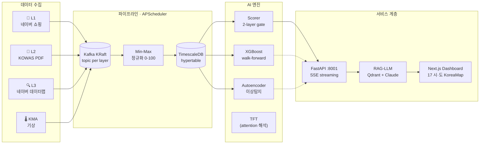

<div align="center">

# 🦠 Urban Immune System

**비의료 신호 3계층 융합으로 감염병을 1~6주 선행 탐지하는 조기경보 시스템**

[](https://github.com/zln02/urban-immune-system/actions)
[](https://www.python.org/)
[](https://fastapi.tiangolo.com/)
[](https://nextjs.org/)
[](LICENSE)
[]()

🏆 **제1회 2026 데이터로 미래를 그리는 AI 아이디어 공모전 대상(1등)** — 한국능률협회

[검증 결과](#-검증-결과) · [아키텍처](#-아키텍처) · [Quick Start](#-quick-start) · [한계와 정직성](#-한계와-정직성)

</div>

---

## 🎯 About

약국 OTC 구매·하수 바이오마커·검색 트렌드라는 **비의료(non-clinical) 신호 3계층**을
**XGBoost 주모델 + TFT 해석성 보조**로 교차검증해 감염병 발생을 임상 신고보다
**평균 6.47주 선행**으로 포착한다.
공공 보건당국(KDCA·지자체 역학조사과) 납품을 목표로 설계된 **B2G SaaS 프로토타입**.

> Google Flu Trends 과대예측 실패 교훈 — **단일 계층 단독 경보 금지**, 최소 2개 계층 교차검증을 게이트 로직으로 강제한다.

| Layer | 데이터 소스 | 단독 선행 | Granger p |
|-------|------------|----------|-----------|
| 💊 L1 약국 OTC | 네이버 쇼핑인사이트 | 8주 | 0.103 |
| 🚰 L2 하수 바이오마커 | KDCA 감염병포털 (KOWAS) | 2주 | 0.267 |
| 🔍 L3 검색 트렌드 | 네이버 데이터랩 | 3주 | 0.007 |
| **3-Layer 앙상블** | (가중 융합) | **3주** | **0.021** |

## 📊 검증 결과

> 17개 시·도 walk-forward 백테스트 · gap = 4주 · 5-fold (2025-2026 인플루엔자 시즌)
> 산출물: [`analysis/outputs/backtest_17regions.json`](analysis/outputs/backtest_17regions.json) — 재현 가능

| Metric | Value | 기준선 |
|---|---|---|
| **F1-Score** | **0.882** | ≥ 0.80 ✅ |
| **Precision** | **0.949** | ≥ 0.90 ✅ |
| **Recall** | **0.837** | ≥ 0.75 ✅ |
| **False Alarm Rate (gate ON)** | **0.206** | < 0.30 ✅ (gate OFF: 0.602) |
| **Lead Time (avg)** | **6.47주** | ≥ 4주 ✅ |
| **MCC** | **0.595** | — |
| **Balanced Accuracy** | **0.816** | — |
| **AUPRC** | **0.973** | — |
| **Granger 인과 (composite)** | **p=0.021** | < 0.05 ✅ |

재현:

```bash
python -m analysis.backtest_2025_flu_multi_17regions
cat analysis/outputs/backtest_17regions.json | jq '.summary'
```

## 🏗 아키텍처



## 🛠 Built With

| Layer | Stack |
|---|---|
| **Frontend** | Next.js 15 · React 19 · Deck.gl · Tailwind · TypeScript |
| **Backend** | FastAPI · SQLAlchemy 2.0 (async) · Pydantic Settings · ReportLab |
| **Pipeline** | APScheduler · httpx · pdfplumber · Kafka KRaft (no ZooKeeper) |
| **ML** | XGBoost (주모델, walk-forward CV) · TFT (PyTorch Lightning, attention 해석성) · Autoencoder (이상탐지) |
| **LLM / RAG** | Claude Haiku · RAG (Qdrant) · multilingual MiniLM 임베딩 |
| **Data** | TimescaleDB (PG 16) · 하이퍼테이블 weekly partition |
| **Infra** | Docker Compose · Kubernetes (GKE) · GitHub Actions · pre-commit |
| **Quality** | pytest (105 ✅) · ruff · mypy --strict · detect-private-key |

## 🚀 Quick Start

### 사전 요구사항
- Python 3.11+, Node.js 20+, Docker 24+
- API 키: `NAVER_CLIENT_ID/SECRET` (쇼핑인사이트+데이터랩 공용), `ANTHROPIC_API_KEY`, `KMA_API_KEY`
- 환경변수: `DB_PASSWORD` (TimescaleDB), `NEXT_PUBLIC_NAVER_MAPS_KEY_ID` (지도, 옵셔널)
- 원격 데모 시: `export UIS_HOST=<your-host>` (없으면 `localhost` 기본)

### 설치

```bash
git clone https://github.com/zln02/urban-immune-system.git
cd urban-immune-system
cp .env.example .env       # API 키 입력

# 인프라 (Kafka + TimescaleDB + Qdrant)
docker compose up -d

# Python
python -m venv .venv && source .venv/bin/activate
pip install -e ".[all]"
pre-commit install
```

### 실행

```bash
# Backend (FastAPI :8001, SSE 포함)
uvicorn backend.app.main:app --reload --port 8001

# Streamlit MVP (Phase 1, fallback)
streamlit run src/app.py --server.port 8501

# Next.js Dashboard (Phase 2, canonical)
cd frontend && npm install && npm run dev
```

브라우저: `http://${UIS_HOST:-localhost}:3000/dashboard` (Next.js) · `http://${UIS_HOST:-localhost}:8501` (Streamlit)

### 검증

```bash
pytest                                      # 105 tests
ruff check src/ backend/ pipeline/ ml/ tests/
mypy src/ backend/
python -m tests.benchmark_xgboost           # 캡스톤 목표값 PASS/FAIL
```

## 📂 Repository Layout

```text
urban-immune-system/
├── frontend/         Next.js 15 dashboard (Phase 2, canonical)
├── src/              Streamlit MVP (Phase 1 fallback)
├── backend/          FastAPI · SSE alerts · ReportLab PDF
├── pipeline/         APScheduler 수집기 + Kafka producer + scorer
├── ml/               XGBoost · TFT · Autoencoder · RAG (Qdrant)
├── analysis/         공모전·재검증 백테스트 스크립트 + outputs/
├── infra/            K8s 매니페스트 · TimescaleDB init.sql
├── tests/            105 pytest (Mock LLM · monkeypatch env)
└── docs/             architecture · data-sources · business/
```

## 🗺 현재 상태 (D-3, 2026-05-04)

- 17지역 baseline 산출 완료 (위 검증 결과 참조)
- TFT D-4 재학습 완료 (encoder=12, pred=2, attention 해석 가능)
- FastAPI backend (port 8001) 라우트/CORS/보안 미들웨어 동작
- Streamlit 대시보드 5탭 + Next.js 14 대시보드 동시 운영
- docker compose 5서비스 e2e 헬스체크 통과
- pytest tests 22개 통과

### 알려진 한계 (Phase 5 이월)

- Kafka Consumer는 InMemoryBroker 사용 중 (실 KRaft consumer 미연결)
- HIRA OpenAPI L1은 전국 단일값 broadcast (지역 분리 미적용)
- ISMS-P 전체 통제항목 풀 점검 미완료

## ⚠️ 한계와 정직성

전문가 운영 시스템 대비 **솔직한 격차**를 명시한다. (운영 인프라 한계는 위 "알려진 한계" 참조)

- **표본 한계**: 시즌 단위 분석 — Granger 검정 통계적 유의성 제한적, 다음 시즌 데이터 누적 필수
- **L2 약함**: 하수 신호 Granger p=0.267로 단독 유의성 부족 → 가중치 0.30으로 축소 검토 중
- **TFT 위치**: 주모델은 XGBoost(walk-forward CV), TFT는 attention 기반 해석성 보조 (D-4 재학습 완료, prod 전환은 데이터 누적 후)
- **L2 자동화**: KOWAS PDF 자동 다운로더 구현됐으나 일부 주차 carry-forward 적용 (`backtest_17regions.json` 참조)
- **데이터 출처**: KCDC 확진 카운트는 내장 아카이브 기반(실시간 KCDC API 미연동)

본 수치는 학부 캡스톤 산출물이며, BlueDot/CDC NWSS 같은 운영 시스템과 직접 비교 불가.

## 👥 Team

| 이름 | 역할 | 담당 |
|------|------|------|
| 박진영 | PM / ML Lead | `ml/` · 전체 아키텍처 · `docs/business/` |
| 이경준 | Backend | `backend/` |
| 이우형 | Data Engineer | `pipeline/` |
| 김나영 | Frontend | `frontend/` (Phase 2) · `src/` (Phase 1) |
| 박정빈 | DevOps / QA | `infra/` · `.github/` · `tests/` |

## 🤝 Contributing

브랜치 전략: `main` (배포) ← `develop` (통합) ← `feature/*` · `hotfix/*`
**main/develop 직접 push 금지** — 반드시 PR. 자세한 컨벤션은 [`CLAUDE.md`](CLAUDE.md).

## 📜 License

MIT — see [LICENSE](LICENSE).

## 🙏 Acknowledgements

- KDCA 감염병포털 (KOWAS 하수감시) · 네이버 검색·쇼핑 데이터랩 · 기상청 공공 API
- 선행연구: [Deng et al. 2-Layer EWS](https://www.frontiersin.org/journals/public-health/articles/10.3389/fpubh.2025.1609615/full) · [Lee et al. 2023 — OTC × Wastewater](https://www.nature.com/articles/s41370-023-00613-2)
- Inspiration: [BlueDot](https://bluedot.global/) · [CDC NWSS](https://www.cdc.gov/nwss/)
