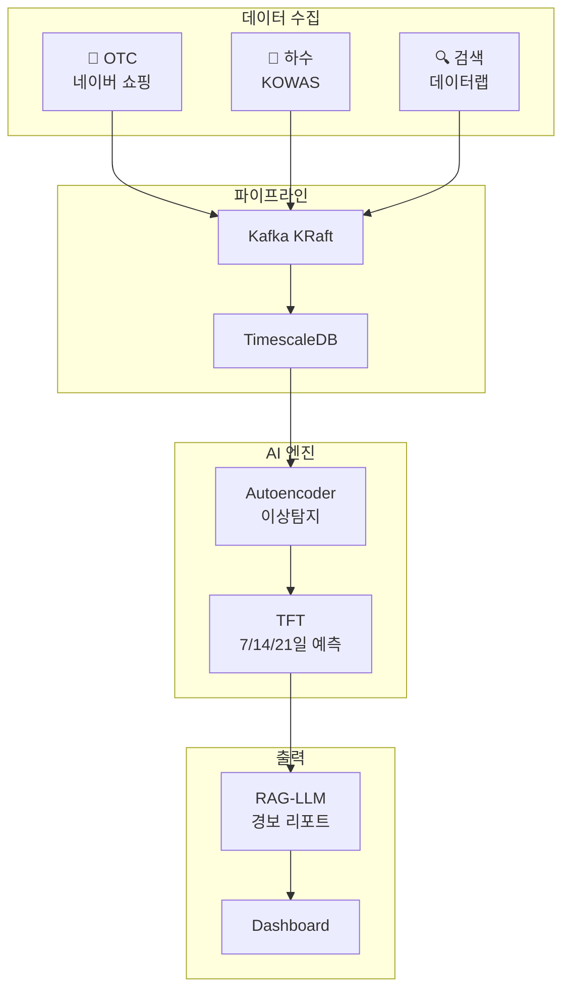

# 🦠 Urban Immune System

[](https://github.com/zln02/urban-immune-system/actions)


> AI 기반 감염병 조기경보 시스템 — 3-Layer 비의료 신호 교차검증

🏆 **제1회 2026 데이터로 미래를 그리는 AI 아이디어 공모전 대상(1등)** — LG전자 DX School

## 핵심 아이디어

| Layer | 데이터 소스 | 선행 시간 |
|-------|------------|----------|
| 💊 약국 OTC | 네이버 쇼핑인사이트 | ~2주 |
| 🚰 하수 바이오마커 | KOWAS 하수감시 | ~3주 |
| 🔍 검색 트렌드 | 네이버 데이터랩 | ~1주 |

3개 비의료 신호를 AI(TFT)로 교차검증하여 감염병을 **1~3주 선행 감지**하고, **RAG-LLM으로 자동 경보 리포트**를 생성합니다.

## 검증 결과

> 🏆 **공모전 대상 수상 시점 결과** (LG전자 DX School, 2026-04):
> - **F1-Score**: 0.71 | **Precision**: 1.00 (오경보 0건)
> - **Granger 인과검정**: 3개 Layer 모두 p < 0.05
> - 2024-25 인플루엔자 시즌 실데이터 기반
>
> ℹ️ **현재 상태 (2026-04-20)**: 캡스톤 단계에서 실제 학습·재현 진행 중. 모델 가중치는 `ml/checkpoints/` 생성 예정. 대시보드 검증 탭의 수치는 `ml/outputs/validation.json` 연결 시 실결과로 대체됨.

## 아키텍처



## 기술 스택

| 계층 | 기술 |
| --- | --- |
| Dashboard | Streamlit (프로토타입) / Next.js + Deck.gl (Phase 2) |
| Backend | FastAPI + SQLAlchemy (async) |
| Pipeline | Kafka KRaft + httpx + pdfplumber |
| ML | PyTorch Forecasting (TFT) + scikit-learn |
| LLM | GPT-4o + LangChain + Qdrant |
| DB | TimescaleDB (PostgreSQL 16) |
| Infra | Docker + Kubernetes (GKE) + GitHub Actions |

## Quick Start

```bash
# 1. Clone & Setup
git clone https://github.com/zln02/urban-immune-system.git
cd urban-immune-system
cp .env.example .env  # API 키 설정

# 2. 인프라 (Kafka + TimescaleDB + Qdrant)
docker compose up -d

# 3. Python 환경
python -m venv .venv && source .venv/bin/activate
pip install -e ".[all]"

# 4. Streamlit 대시보드
streamlit run src/app.py --server.port 8501

# 5. Backend API
uvicorn backend.app.main:app --reload --port 8000
```

## 프로젝트 구조

```text
├── src/           # Streamlit 대시보드 (5탭)
├── backend/       # FastAPI REST API
├── pipeline/      # 데이터 수집 (Kafka producers)
├── ml/            # TFT + Autoencoder + RAG-LLM
├── frontend/      # Next.js + Deck.gl (Phase 2)
├── infra/         # K8s 매니페스트 + DB 스키마
├── analysis/      # 공모전 분석 코드 (아카이브)
├── prototype/     # 레거시 Streamlit (보존)
├── tests/         # pytest
└── docs/          # 문서
```

## 팀

| 이름 | 역할 | 담당 모듈 |
| --- | --- | --- |
| 박진영 | PM / ML Lead | `ml/`, 전체 아키텍처 |
| 이경준 | Backend | `backend/` |
| 이우형 | Data Engineer | `pipeline/` |
| 김나영 | Frontend | `frontend/`, `src/` |
| 박정빈 | DevOps / QA | `infra/`, CI/CD |

## 브랜치 전략

| 브랜치 | 용도 |
| --- | --- |
| `main` | 배포 가능한 안정 버전 |
| `develop` | 개발 통합 |
| `feature/*` | 기능 개발 (`develop`에서 분기) |
| `hotfix/*` | 긴급 수정 |

## 개발

```bash
pytest
ruff check src/ tests/
mypy src/
```

## License

MIT License

