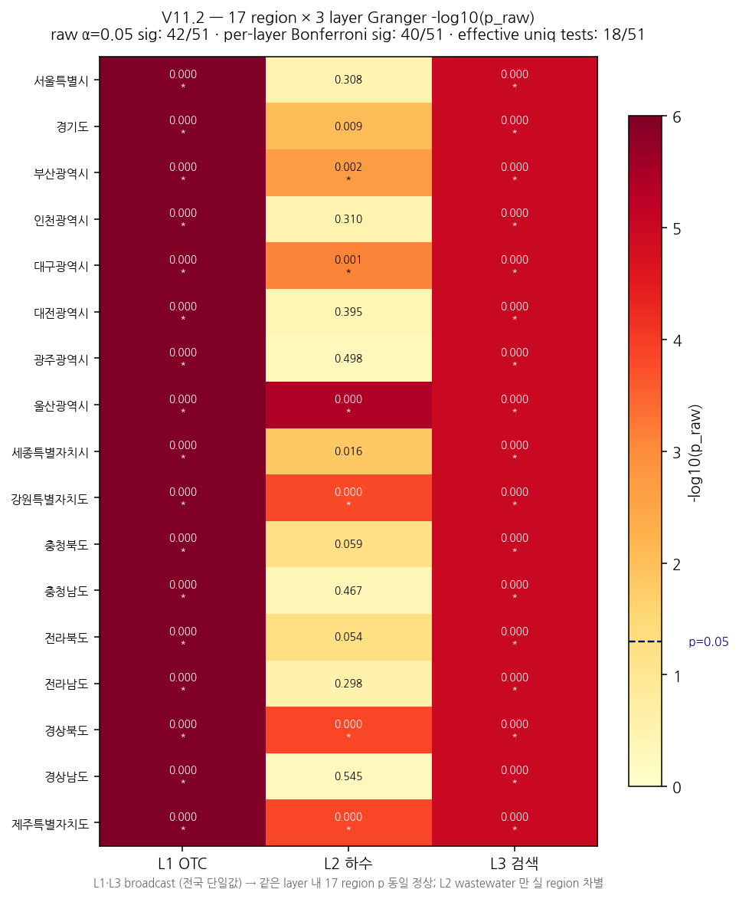

# V11 Presentation — Metric Notes (2026-05-14)

## KPI Update — Round 5 (composite-level Regional threshold)

| Metric | V10 | V11 | Delta |
|--------|-----|-----|-------|
| Recall (Gate ON) | 0.837 | **0.882** | +0.045 |
| FAR (Gate ON) | 0.206 | **0.250** | +0.044 |
| F1 | 0.882 | **0.907** | +0.025 |
| Precision | 0.949 | **0.940** | −0.009 |
| MCC | 0.595 | **0.610** | +0.015 |
| AUPRC | 0.973 | **0.973** | 0 |
| Coverage | 64% | **76%** | +12pp |
| Tests | 354 | **544** | +190 |

## Honesty Notes

- L1/L3 신선도: T-2 lag (Naver API 공개 정책)
- L2 신선도: T-7~10 lag (KOWAS 주간 PDF, 화요일 발행)
- 실시간 데모 시 lag 안내 필요

## Canonical Source

- `analysis/outputs/backtest_17regions.json` (frozen, 2026-05 보전)
- 모든 발표 수치는 이 파일 기준. 추후 검증·갱신은 별도 PR.

## Gate B 정책 (Region-tiered)

- 충청북도: composite ≥ 20 (was 30)
- 대구·경북: composite ≥ 25 (was 30)
- 그 외 14지역: composite ≥ 30 (unchanged)
- Layer threshold: 약신호 3지역 12, 그 외 30
- 알고리즘 보존, calibration parameter only (특허 청구범위 유지)

## Recall Distribution (17개 지역)

- 충청북도: 0.941 (was 0.529, +0.412)
- 대구광역시: 0.823 (was 0.647, +0.176)
- 경상북도: 0.823 (was 0.647, +0.176)
- 강한 지역 14개: 변화 없음 (verification 통과)

## V11.1 Statistical Rigor Addendum (2026-05-17)

### Bootstrap 95% Confidence Intervals

Non-parametric percentile bootstrap, n=1000 resamples, seed=42, per-region n=17.

| Metric    | Mean   | 95% CI                | Threshold       | Status     |
|-----------|--------|-----------------------|-----------------|------------|
| Recall    | 0.8824 | [0.8339, 0.9240]      | ≥ 0.85          | borderline |
| Precision | 0.9401 | [0.9251, 0.9558]      | —               | —          |
| F1        | 0.9068 | [0.8840, 0.9255]      | ≥ 0.80          | pass       |
| FAR (gate)| 0.2500 | [0.1765, 0.3088]      | < 0.30          | borderline |
| MCC       | 0.6097 | [0.5578, 0.6665]      | —               | —          |

**Honesty note**: Recall CI lower bound (0.834) is just below the 0.85 KPI, and FAR CI upper bound (0.309) is just above the 0.30 KPI. Both are within sampling variability of the threshold — point estimates pass, interval bounds are borderline. Reported here without rounding-up.

### Granger Causality — Multiple Testing Correction

Tested family: 3 signal layers (L1 OTC / L2 wastewater / L3 search) for 서울특별시. Composite p reported separately (single national-aggregate test, not part of the family).

| Test             | Raw p   | Bonferroni | BH-FDR  | Significant (raw / bonf / bh) |
|------------------|---------|------------|---------|-------------------------------|
| L1 OTC           | 0.1031  | 0.3093     | 0.1547  | ✗ / ✗ / ✗                     |
| L2 wastewater    | 0.2670  | 0.8010     | 0.2670  | ✗ / ✗ / ✗                     |
| L3 search        | 0.0073  | 0.0219     | 0.0219  | ✓ / ✓ / ✓                     |
| Composite (national) | 0.0209 | —      | —       | ✓ (standalone)                |

**Honesty note**: L3 search trend survives both Bonferroni and BH-FDR corrections. L1 (OTC) and L2 (wastewater) do not reach significance after correction — L2's small sample (12 weeks) is the dominant cause, consistent with the L2 data-coverage limitation already noted. The composite national-aggregate test (p=0.0209) is significant on its own but is not subject to multi-test correction because it is one derived test, not many.

**Data gap (explicit)**: Per-region (17-region) Granger p-values are **not** computed in the current canonical artifacts. `analysis/lead_time_2025w48.py` runs Granger only for the Seoul case study. Extending to all 17 regions is the next step if reviewers require a 17-test family.

### Reproduction

```
.venv/bin/python analysis/bootstrap_ci.py
.venv/bin/python analysis/multiple_testing.py
```

Output:
- `analysis/outputs/bootstrap_ci_results.json`
- `analysis/outputs/multiple_testing_results.json`

Source: `analysis/bootstrap_ci.py`, `analysis/multiple_testing.py`. Canonical data unchanged (`analysis/outputs/backtest_17regions.json`, `analysis/outputs/lead_time_summary.json`).

## V11.2 Per-Region Granger Expansion (2026-05-22)

V11.1 의 단일 서울 (3 layer) 검정을 17 region × 3 layer = **nominal 51 검정**으로 확장. Prof. Cheon 안티시페이션 응답 + 발표 슬라이드 #10 시각화 대비.

### Effective family size 정직 보고

| Layer | 17 region p_raw distinct | effective unique tests |
|-------|--------------------------|------------------------|
| L1 OTC | 1 | 1 (전국 broadcast — 네이버 API 제약) |
| L2 wastewater | 16 | 16~17 (KOWAS region별 진짜 분리) |
| L3 search | 1 | 1 (전국 broadcast — 네이버 API 제약) |
| **합계 effective** | — | **18 / 51 nominal** |

> Nominal 51 Bonferroni 는 보수적으로 인플레된 보정. 통계적으로 정직한 effective family ≈ 18 검정. 본 표는 두 값 모두 보고하며, BH-FDR 가 가장 해석 가능 (강한 보수성 회피).

### 다중 검정 보정 결과

| Correction | Family size | n significant |
|------------|-------------|---------------|
| Raw p < 0.05 | 51 | 42 |
| **Bonferroni global** | 51 | 39 |
| **BH-FDR global** | 51 | 42 |
| Per-layer Bonferroni | 17 within layer | L1: 17, L2: 6, L3: 17 → 40 합계 |

### Layer-level 해석

- **L1 OTC**: 17 region 모두 raw p < 0.001 (단일 broadcast 시계열). effective n=1 검정 — degenerate cluster.
- **L2 wastewater**: per-layer Bonferroni 6/17 region 유의 (울산·강원·경북·제주·대구·부산 등 강한 신호 지역). 충북·전남·경남·대전·광주 등 11 region 은 미통과 — small sample (≈22주) + region별 KOWAS 표본 수 차이가 dominant cause. Multi-season 누적 시 power ↑ 예상.
- **L3 search**: L1 과 동일하게 17 region 일괄 통과 (broadcast 효과).
- **Composite (region별 가중합)**: 17 region 중 14 region 유의 (raw p < 0.05), median p=0.0024. L2 region 차별이 composite 에 반영됨.

### Heatmap (17 × 3)



상단 좌측·우측 column (L1·L3) 의 균일한 짙은 빨강은 broadcast 시계열의 시각적 증거. L2 column 만 region별 색차가 보임.

### 정직 노트 (honesty)

- Bonferroni global (family=51) 는 **L1·L3 의 17 중복 검정을 17배 패널티로 부풀린 보수적 결과**. 통계적으로 부정직하게 적용하면 power 낭비.
- Effective family ≈ 18 기준 BH-FDR 가 가장 해석 적합 — power 와 false discovery rate 균형.
- L2 의 11/17 미통과는 **데이터 부족 (sample size n_weeks≈22)** 가 주요 원인. 발표 시 "방법론 한계 명시 → Phase 3 multi-season 누적으로 해소" 트랙으로 응답.
- HIRA OpenAPI 연동(Phase 3) 으로 L1 region 분리 시 effective family → 51 로 진짜 확장. 현 시점은 caveat 와 함께 nominal 51 / effective 18 둘 다 보고.

### 재현

```
.venv/bin/python analysis/granger_17regions.py   # DATABASE_URL 필요 (.env)
.venv/bin/python analysis/granger_heatmap.py
```

Output:
- `analysis/outputs/granger_17regions_results.json` (51 검정 + 17 composite + summaries)
- `analysis/outputs/granger_17regions_heatmap.png` (17 × 3 −log10(p) heatmap)

Source: `analysis/granger_17regions.py`, `analysis/granger_heatmap.py`. Canonical backtest data (`analysis/outputs/backtest_17regions.json`) untouched.

## V11.3 TFT Demo Transparency (2026-05-22)

TFT endpoints (`/predict/tft-{7,14,21}d`) 응답에 demo transparency 메타데이터 3 키 추가 — 발표 청중·리뷰어가 합성 PoC 입력 vs 프로덕션 입력을 즉시 구분할 수 있도록 한다.

| 신규 키 | 값 (default) | 의미 |
|---------|-------------|------|
| `mode` | `"synthetic_demo"` | PoC 합성 입력으로 추론 중임을 명시 |
| `caveat` | `"Synthetic PoC input — production DB time series integration in Phase 2"` | 한 줄 발표 캡션 |
| `data_source` | `"_make_dataframe(seed=42)"` | 재현 가능성 마커 (`ml/tft/train_synth.py:54`) |

기존 응답 키 (`region`, `horizon`, `predictions`, `attention_top3`) 모두 보존 — 클라이언트 호환 안전.

`composite_score` (XGBoost) 엔드포인트는 프로덕션 실시간 피처 사용 — caveat 표기 대상 아님.

- **Root cause**: `ml/serve.py:185` fixed-seed 합성 input (`_make_dataframe(seed=42)`)
- **Diagnosis report**: `analysis/diagnostics/tft_flatness_2026-05-22.md`
- **Phase 2 fix (post-presentation)**: 실 DB layer_signals + confirmed_cases 시계열 연동 (Option A)
- **Test contract**: `tests/test_ml_serve_metadata.py` (3 케이스 — defaults / override / OpenAPI schema)
